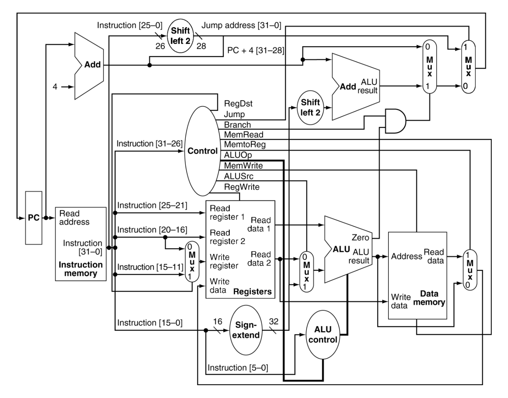
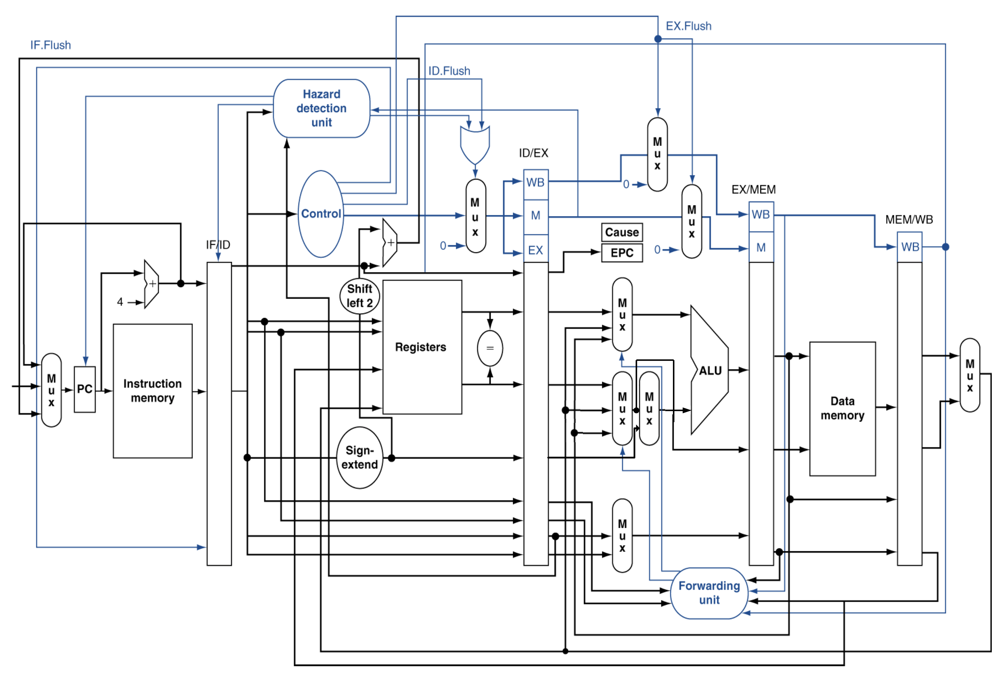

# Simple Simulator of MIPS CPU Written in Verilog

# Documentation 

This project is a course project in *VE370 Computer Organization* [@UM-SJTU Joint Institute](https://www.ji.sjtu.edu.cn/). In general, we implement an simple simulator of MIPS CPU with both single-cycle and pipeline version in Verilog, which can fetch machine code from files and simulate the CPU processing.

## Supporting MIPS Instruction Set
- The memory-reference instructions load word (`lw`) and store word(`sw`)
- The arithmetic-logical instructions `add`, `addi`, `sub`, `and`, `andi`, `or`, and `slt`.
- The jumping instructions branch equal (`beq`), branch not equal (`bne`), and jump (`j`).

## Single Cycle CPU

The implementation is shown in architecture diagram below.

## Pipeline CPU

The implementation is shown in architecture diagram below.

From the design we can see that we basically divided the single-cycle processor into 5 different stages to improve the CPU performance. The five stages include:

- `IF` (instruction fetch): get the instruction at the PC
- `ID` (instruction decode): decode the instruction,produce control signals and read register file
- `EX` (excecute): do calculation
- `MEM` (memory): access memory
- `WB` (write back): write back to register

To realize this division, we kept the important modules like instruction memory, register file, ALU, etc. and added four large register to store the values from the previous instruction. The large registers are named `IF/ID`, `ID/EX`, `EX/EXM`, and `MEM/WB`, which indicate their positions.
We also added the Hazard Detection Unit and the Forwarding Unit to solve the data hazards, control hazards and branch hazards. The Forwarding Unit can forward the data from the previous instructions that are still being excuted and thus solve some data hazard, and the Hazard Detection Unit can detect some control hazard and branch hazard and insert stall to make sure the CPU gets the correct result.

## Simulation
Run simulation in testbench with instructions fetched from file
- Format: one instruction per line, no space in one line
- Sample: please refer to `InstructionMem_Demo.txt`
